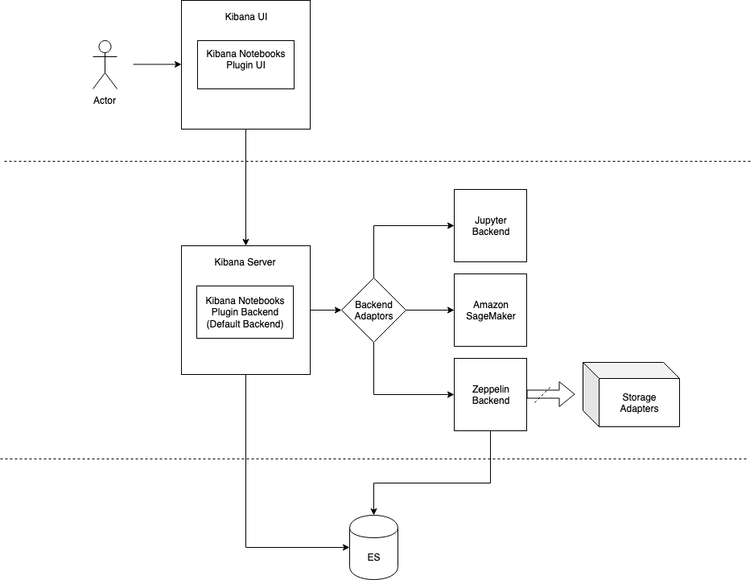
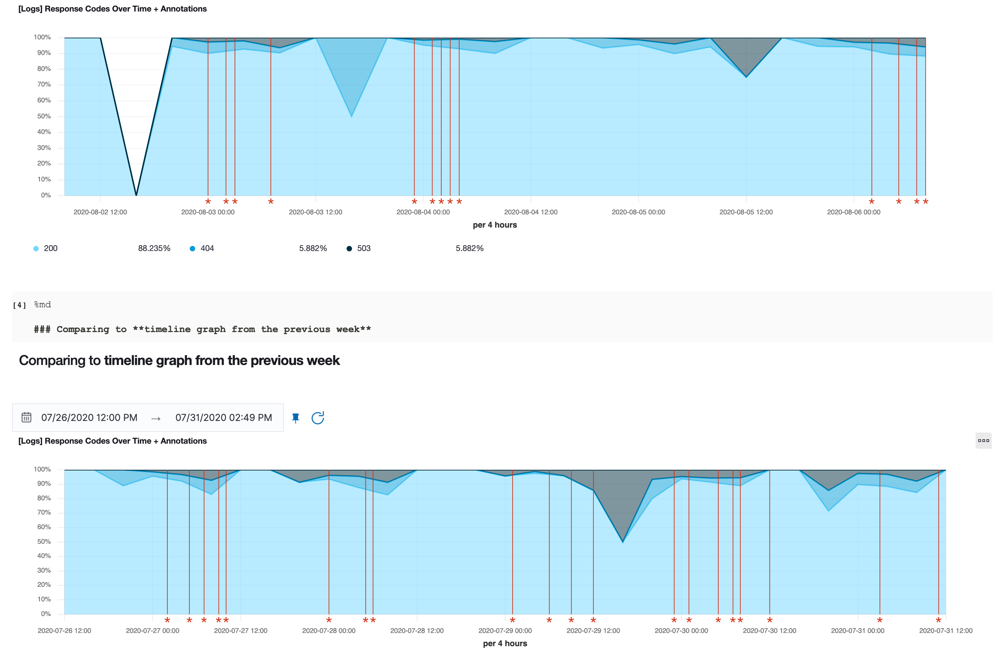

# RFC - Kibana Notebooks

## 1. Overview

### 1.1 Introduction

Kibana Notebooks provide a browser-based [REPL](https://en.wikipedia.org/wiki/Read%E2%80%93eval%E2%80%93print_loop) built upon a number of popular [open-source](https://en.wikipedia.org/wiki/Open-source_software) libraries. Kibana Notebooks enable data-driven, interactive data analytics and collaborative documents to be created and used as live notes in Kibana. They allow devops, support specialists, solution and presales specialists, customer success experts and engineers to create and share stories They facilitate combining visualizations, timelines and text, code and adding annotations. The notebook is a collection of cells- paragraphs for adding code or markdown text, and output cell that displays the output of the markdown/code. Here are a few Kibana Notebooks use-cases:

1. Create post-mortem documents

1. Design runbooks

1. Build Live infrastructure reports

1. Foster data driven explorative collaborations 

### 1.2 Motivation

Dashboards offer a solution for a few selected use cases, and are a great tool if you’re focused on monitoring a known set of metrics over time. Kibana Notebooks enable contextual use of data with detailed explanations by allowing a user to combine saved visualizations, text, graphs and embellish data in Elasticsearch with other reference data sources.

## 2. Requirements

**Notebooks**

1. As a user, I should be able to use Kibana Notebooks plugin UI for all the interactions
1. As a user, I should be able to View all the notebooks available
1. As a user, I should be able to Create, Edit, Rename, Delete and Clone Notebooks
1. As a user, I should be able to Import and Export Notebooks for collaborative story telling

**Paragraphs**

1. As a user, I should be able to use Create, Edit, Save, Delete and Clone Paragraphs
1. As a user, I should be able to use Toggle all Inputs of paragraphs
1. As a user, I should be able to use Clear and Toggle all Outputs of paragraphs

**Visualizations**

1. As a user, I should be able to embed Saved Visualizations
1. As a user, I should be able to Resize and Delete embedded Visualizations
1. As a user, I should be able to use multiple timelines for different visualizations
1. As a user, I should be able to Inspect Visualization Data

**Default Backend**

1. As a user, I should be able to use Visualizations and Markdown interpreter in Notebooks
1. As a user, I should be able to use SQL and DSL query interpreters in Notebooks
1. As a user, I should be able to store Notebooks as elasticsearch indices

**Backend Adaptors**

1. As a user, I should be able to plug an addon external backend services(like Zeppelin, Amazon SageMaker, Jupyter) to the plugin using adaptors
1. As a user, I should be able to use all the interpreters provided by the plugged backend service in addition to those provided by default
1. As a user, I should be able to use the storage adaptors provided by the plugged backend service
1. As a user, I should be able to use external data sources and environments provided by the plugged backend service

## 3. Design & Implementation

### 3.1 Design Details

1. **Kibana Notebooks Plugin UI**

   1. **Build UI in react with open source react libraries**
      - React based UI, uses elements from [Elastic UI](https://elastic.github.io/eui/#/) elements & [Nteract.io components](https://components.nteract.io/)
      - **Elastic UI**
        - Used for blending notebooks in Kibana Plugins environment
        - All container UI components and buttons use EUI components
      - **Nteract Components**
        - _Presentational-components_ module of nteract is used specifically for notebook UI
        - _Outputs_ module is used for rendering markdown if backend adaptor doesn't have a markdown interpreter
      - **Notebooks UI**
        - Each notebook is composed of many paragraphs
        - Each paragraph contains an input and output component
        - An input component contains code for that paragraph
        - An output component contains execution result for that paragraph
   2. Here’s a sample wireframe
      

2. **Kibana Notebooks Plugin Backend**

   1. Uses the Hapi Backend Contianer provided by Kibana
   1. Provides API routes for connecting UI components to a backend service
   1. _Router Modules_:
      - NotebookConnector - routes Notebook CRUD operations
      - ParagraphConnector - routes Paragraph CRUD operations
   1. _Default Backend_:
      - Provides markdown interpreter support for notebooks
      - Provides ability to embed saved visualizations using Dashboard Containers
      - FUTURE: provide interpreter support for SQL and DSL queries

3. **Backend Adaptors**

   1. A Backend Adaptor provides an interface to connect external notebook backends
   1. An external notebook backend service is connected through a HTTP endpoint
   1. Once a backend service is connected all the interpreters, environments and data sources provided by the service are automatically extended in notebooks
   1. Uses [Hapi Wreck](https://hapi.dev/module/wreck/) to connect a backend service with a HTTP endpoint

   1. Example Adaptor: **Zeppelin Backend Service**
      
      1. Open source, provided by [Apache Zeppelin](http://zeppelin.apache.org/)
      1. Provides all communication to and from a notebook & provides support for 25+ interpreters with REST APIs
      1. Connects via a HTTP endpoint to the Plugin backend
         - [Interpreter APIs](http://zeppelin.apache.org/docs/0.9.0-preview1/usage/rest_api/interpreter.html) Get interpreter settings, create/update/restart/delete interpreter setting
         - [Notebook APIs](http://zeppelin.apache.org/docs/0.9.0-preview1/usage/rest_api/notebook.html) Create/update/restart/delete noteboooks and paragraphs
      1. Provides inter-para communication capabilities
      1. Can be setup to provide elasticsearch and ODFE-SQL interpreters
      1. Can be connected with python environment to use ML/plot libraries

### 3.3 Screenshots:

- **Default Backend**

  - **Markdown Interpreter**
    
  - **Embedding Saved Visualizations**
    
  - **Multi-Timeline Support**
    

- **Zeppelin Backend Adaptor**

  - **Kibana Plugin Sample UI**:
    
  - **Make requests to Elastic Service**:
    
  - **Transmit Data between Interpreters**:

  - Use output of an ODFE Query as save as a Zeppelin Context in a variable
    
  - Use the Zeppelin Context vairable and import it in python
    

  - **Plot Visualization with Language specific Viz. tools (like Matplotlib)**:
    

## 4. User Stories

**Operations on notebooks**

1. Create: As a user, I should be able to create a notebook. 
1. View: As a user, I should be able to view the notebook. 
1. Save: As a user, I should be able to save the notebook.
1. Checkpoint: The notebook automatically saves the notebook after every 3 minutes. If the user loads the notebook after the checkpoint is triggered, it will allow load the content till that point. 
1. Save, Autosave: The notebook can saved. After a given time period, the autosave is triggered on the notebook. 
1. Clone: As a user, I should be able to clone the notebook 
1. Rename: As a user, I should be able to rename the notebook 
1. Delete: As a user, I should be able to delete the notebook 

**Create, Edit, Delete content in an individual notebook**

1. As a user, I should be able to add paragraphs to a notebook. I should be able to add markdown or code to a paragraph. 
1. Markdown in a paragraph allows adding text and enables the use of titles/headings, images, lists and hyperlinks. 
1. Code can be added in the form of queries, DSL, PPL, SQL etc. 
1. As a user, I should be able to execute the code block or the markup and the output will get reflected in the output cell. The output will display text, images, lists, visualizations/graphs etc. 
1. As a user, I should be able to annotate the output with comments/tags, usernames, time/date etc. using markdown
1. Time periods: As a user I should be able to set the date/time periods or date/time to the individual output cells. By default, the date/time reflected is global. This is different from the actual timestamp on when the content was edited. 
   
**Share, export and download notebooks**
1. As a creator of notebooks, I should be able to share a Kibana Notebook with other users so that they can view and/or edit the notebooks as per the privileges and permissions they have. 
1. I should also be able to share the notebook as a pdf via email. I should also be able to download the story as a pdf.

**List of Notebooks**
1. As a user, I should be able to add the notebooks to a list of notebooks. The list of notebooks shows name of the notebook, creator’s details, and last modified dates. 
1. I should be able to view, share and download the individual notebooks in the list of notebooks. 
1. I should be able to view the list of notebooks. 
1. I should be able to filter notebooks based on whether I created or someone else created them and as per dates modified.

## Appendix

_**What ideas do we have to address the above customer problem/opportunity?**_

- Introduce notebooks to users as a training tool
- Allow users to connect and join other datasets using external interpreters

_**Open source components used to build the tool**_

- Built on [Nteract.io components](https://components.nteract.io/), [Apache Zeppelin](http://zeppelin.apache.org/)

